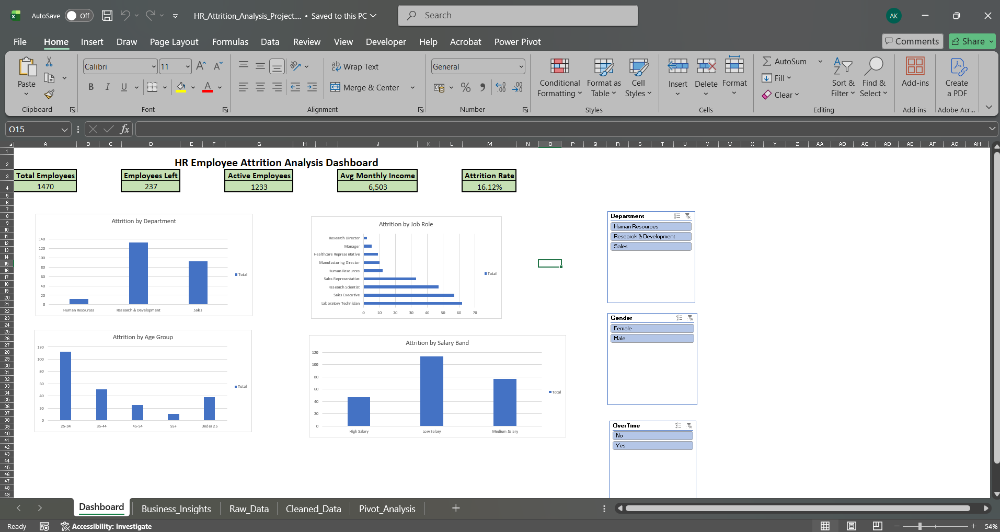
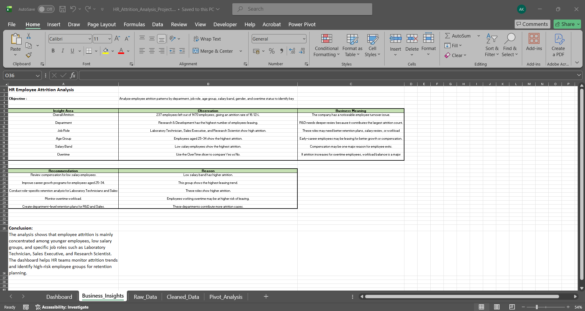

# HR Employee Attrition Analysis Dashboard using Excel

## Project Overview

This project analyzes employee attrition patterns using Microsoft Excel. The goal is to identify key factors contributing to employee turnover across departments, job roles, age groups, salary bands, gender, and overtime status.

The final output is an interactive Excel dashboard with KPI cards, PivotCharts, slicers, and a business insights sheet.

## Dashboard Preview

## Business Objective

To help HR teams understand employee attrition trends and identify high-risk employee groups for better retention planning.

## Dataset

The project uses an HR employee attrition dataset containing employee details such as:

* Age
* Department
* Job Role
* Gender
* Monthly Income
* Attrition Status
* Overtime
* Job Satisfaction
* Work-Life Balance
* Years at Company

## Tools Used

* Microsoft Excel
* PivotTables
* PivotCharts
* Slicers
* Excel Formulas
* Conditional Formatting
* Data Cleaning

## Key Excel Features Used

* Created calculated columns such as Attrition Flag, Active Flag, Age Group, Salary Band, Experience Band, Job Satisfaction Label, and Work-Life Balance Label.
* Built PivotTables to summarize attrition by department, job role, age group, and salary band.
* Designed an interactive dashboard with KPI cards and slicers.
* Added a business insights sheet with observations and recommendations.

## Dashboard KPIs

* Total Employees: 1,470
* Employees Left: 237
* Active Employees: 1,233
* Average Monthly Income: 6,503
* Attrition Rate: 16.12%

## Key Insights

* The overall attrition rate is 16.12%.
* Research & Development has the highest number of employees leaving.
* Laboratory Technician, Sales Executive, and Research Scientist roles show higher attrition.
* Employees aged 25–34 show the highest attrition.
* Low salary employees show higher attrition compared to other salary groups.
* Overtime can be analyzed using slicers to understand its impact on employee attrition.

## Business Insights Preview

## Business Recommendations

* Review compensation plans for low salary employees.
* Create retention programs for employees aged 25–34.
* Conduct role-specific retention analysis for Laboratory Technicians, Sales Executives, and Research Scientists.
* Monitor overtime workload to reduce employee burnout.
* Build department-level retention strategies for R&D and Sales teams.

## Project Outcome

Built an interactive Excel dashboard that helps HR teams monitor attrition trends, identify high-risk employee groups, and make data-driven employee retention decisions.
