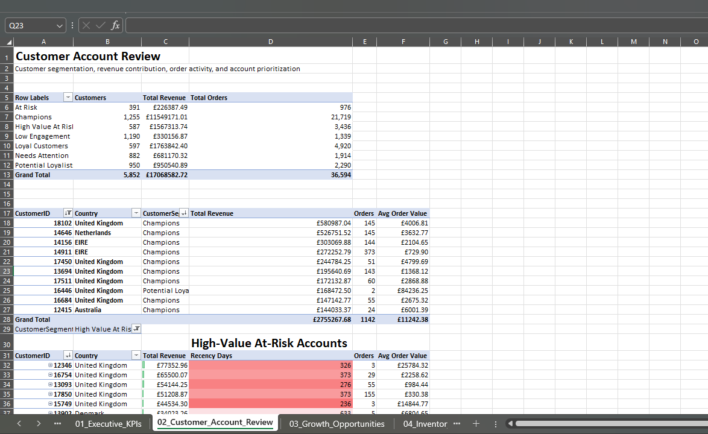
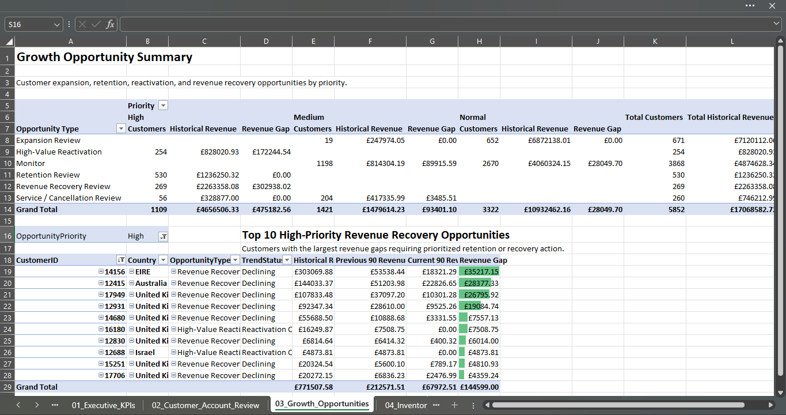
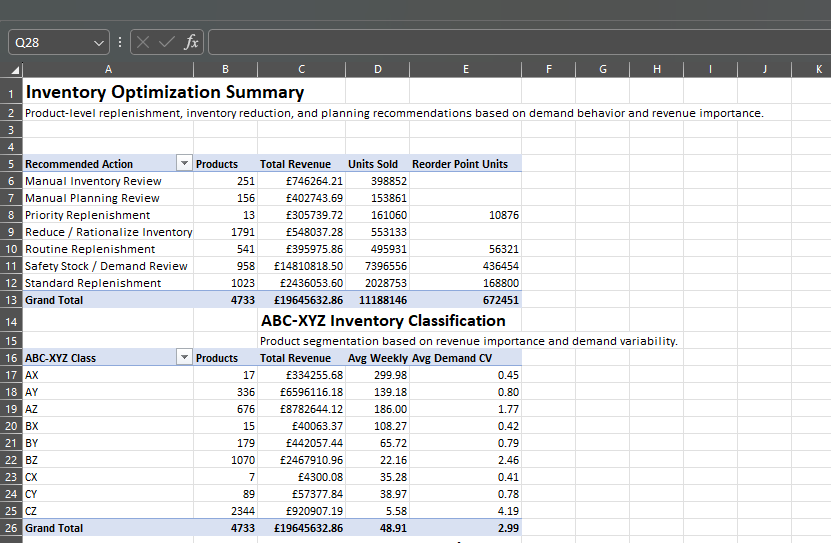
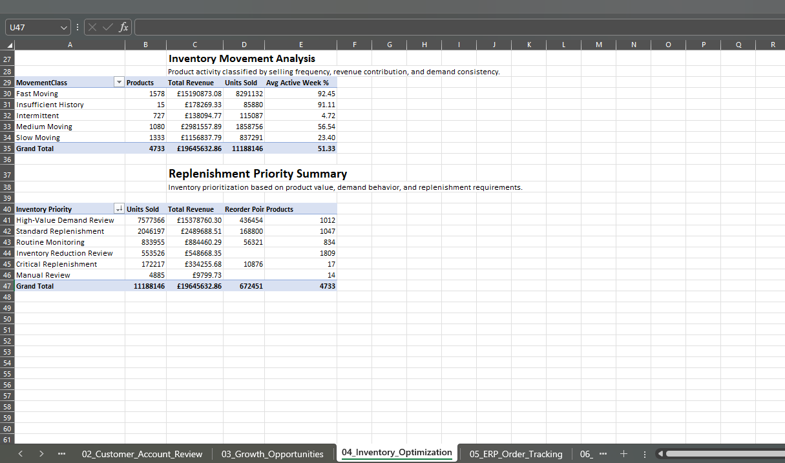
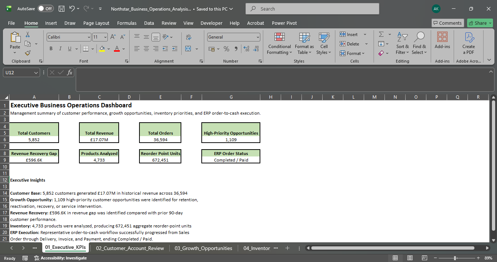
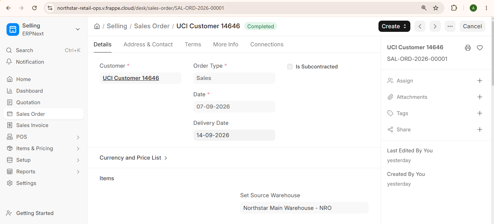
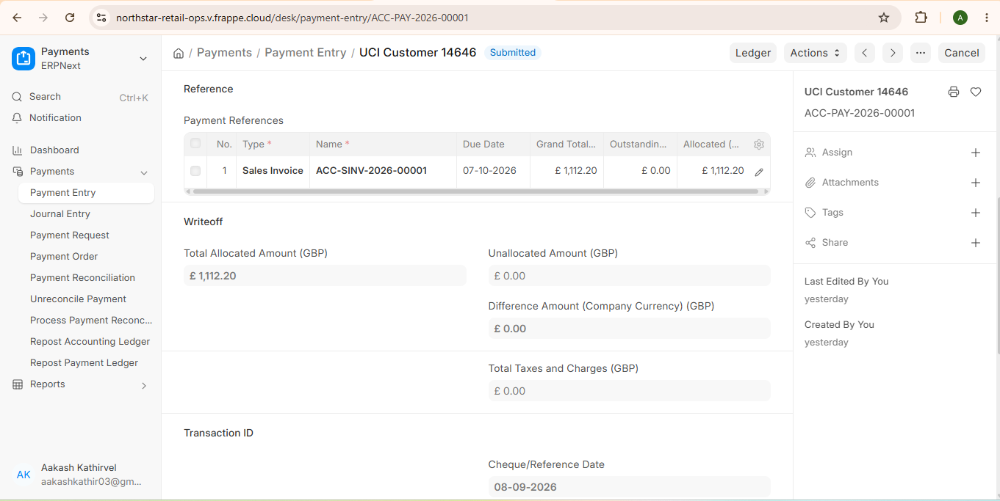

# Customer Sales & Inventory Operations Optimization

End-to-end business operations analytics project using **Python, SQL Server, Excel, Power Query, and ERPNext** to analyze customer performance, identify revenue opportunities, optimize inventory planning, and demonstrate an order-to-cash workflow.

---

## Project Overview

This project uses the **UCI Online Retail II dataset** with more than **1.07M retail transactions** to answer key business questions:

- Which customers generate the most revenue?
- Which valuable customers are becoming inactive?
- Where are the biggest revenue recovery opportunities?
- Which products require replenishment?
- Which products should be monitored or reduced?
- How can analytical recommendations connect to an ERP workflow?

---

## Tech Stack

**Python | SQL Server | Excel | Power Query | ERPNext | RFM Analysis | ABC-XYZ Analysis | Inventory Planning | Git/GitHub**

---

## Key Results

| KPI | Result |
|---|---:|
| Transactions Analyzed | **1.07M+** |
| Customers | **5,852** |
| Revenue | **£17.07M** |
| Orders | **36,594** |
| High-Priority Customer Opportunities | **1,109** |
| Revenue Recovery Gap | **£596.6K** |
| Products Analyzed | **4,733** |
| Aggregate Reorder Point Units | **672,451** |

---

## What I Built

### 1. Customer Account Analytics

Built SQL-based **RFM customer segmentation** to classify customers into groups such as:

- Champions
- Loyal Customers
- Potential Loyalists
- High Value At Risk
- At Risk
- Needs Attention
- Low Engagement

The Excel reporting layer highlights:

- customer segment performance
- Top 10 customer accounts
- high-value at-risk customers
- revenue and order contribution



---

### 2. Growth Opportunity Analysis

Created customer-level opportunity logic to identify:

- Expansion Review
- High-Value Reactivation
- Retention Review
- Revenue Recovery Review
- Service / Cancellation Review

Customers were also classified into **High, Medium, and Normal priority** groups.

Key result:

**1,109 high-priority customer opportunities** were identified with a total **£596.6K revenue gap** versus prior 90-day performance.



---

### 3. Inventory Optimization

Built an inventory planning model combining:

- **ABC classification** — product revenue importance
- **XYZ classification** — demand variability
- **Movement classification** — fast, medium, slow, intermittent
- Safety stock
- Reorder point
- Inventory priority
- Inventory reduction recommendations

Final recommendations were created for **4,733 products**.

Examples of inventory priorities:

| Inventory Priority | Products |
|---|---:|
| High-Value Demand Review | **1,012** |
| Standard Replenishment | **1,047** |
| Routine Monitoring | **834** |
| Inventory Reduction Review | **1,809** |
| Critical Replenishment | **17** |





---

## Executive Business Operations Dashboard

Built a refreshable Excel + Power Query management dashboard summarizing customer, growth, inventory, and ERP performance.



---

## ERPNext Order-to-Cash Workflow

A representative historical retail transaction was recreated in **ERPNext** to demonstrate how analytical data can connect to operational business processes.

### Transaction

- Customer: **UCI Customer 14646**
- Sales Order: **SAL-ORD-2026-00001**
- Products: **4**
- Quantity: **640 units**
- Order Value: **£1,112.20**
- Final Status: **Completed / Paid**

### Workflow

```text
Sales Order
    ↓
Delivery Note
    ↓
Sales Invoice
    ↓
Payment Entry
    ↓
Completed / Paid
```





---

## Data Pipeline

```text
UCI Online Retail II
        ↓
Python Profiling & Cleaning
        ↓
SQL Server
        ↓
Customer + Inventory Analytics
        ↓
Power Query
        ↓
Excel Management Reporting
        ↓
ERPNext Operational Workflow
```

---

## Repository Structure

```text
customer-sales-inventory-operations-optimization/
│
├── data/
│   └── erpnext_imports/
│
├── excel/
│   └── Northstar_Business_Operations_Analysis.xlsx
│
├── python/
│   ├── 01_data_ingestion.ipynb
│   ├── 02_data_profiling.ipynb
│   ├── 03_data_cleaning_etl.ipynb
│   └── 04_sql_staging_load.ipynb
│
├── sql/
│   ├── 01_create_staging_tables.sql
│   ├── 02_create_core_model.sql
│   ├── 03_populate_dimensions.sql
│   ├── 04_populate_fact_tables.sql
│   ├── 05_create_analytics_views.sql
│   ├── 06_customer_account_analysis.sql
│   ├── 07_customer_growth_opportunity_analysis.sql
│   ├── 08_inventory_optimization.sql
│   └── 09_erpnext_export.sql
│
└── screenshots/
```

---

## Assumptions

The source dataset does not contain actual:

- on-hand inventory
- inventory valuation cost
- supplier lead times

Therefore, ERPNext opening inventory and valuation rates were created as **training assumptions**, while safety stock and reorder points were modeled from historical demand.

---

## Skills Demonstrated

**SQL Server | Python | Data Cleaning | Data Modeling | RFM Segmentation | Customer Analytics | Inventory Analytics | ABC-XYZ Analysis | Reorder Point Planning | Excel | Power Query | PivotTables | ERPNext | Order-to-Cash | Business KPI Reporting**

---

## Author

**Aakash Kathirvel**  
Data Analytics | Business Intelligence | Business Operations Analytics
