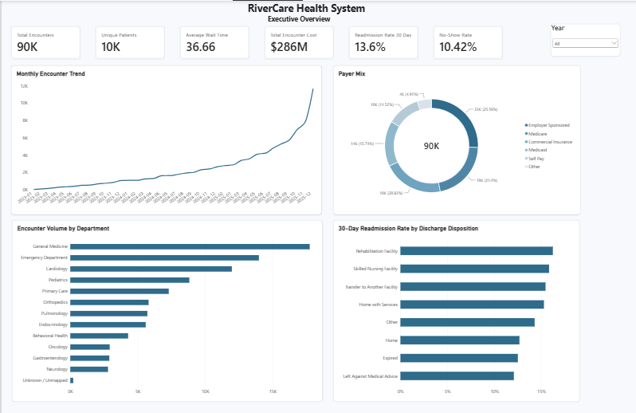
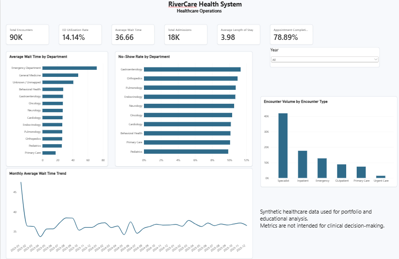
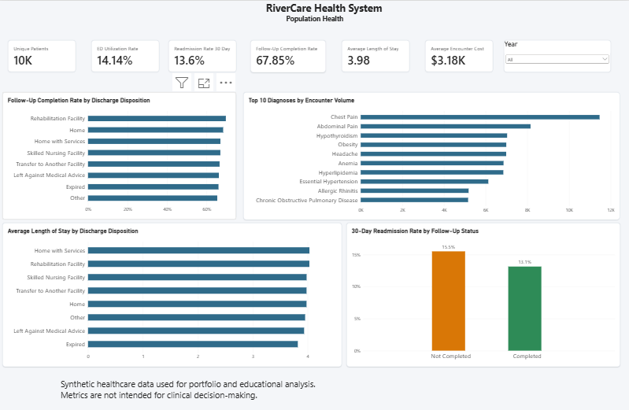
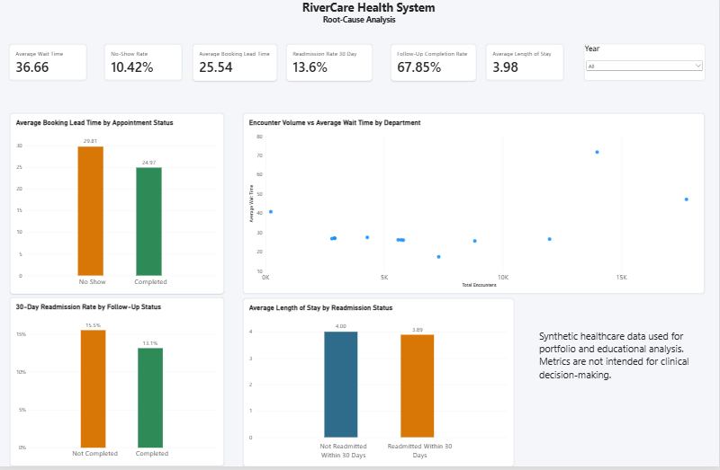

# Healthcare Operations & Population Health Analytics

An end-to-end healthcare business intelligence project built for a fictional **RiverCare Health System** using **Python, Microsoft SQL Server, and Power BI**.

The solution transforms synthetic healthcare data into a validated dimensional warehouse and interactive BI environment for analyzing operational performance, appointments, utilization, readmissions, costs, and population-health trends.

> **Portfolio Project:** All healthcare data used in this project is synthetic. No real patient or protected health information is included.

---

## Project Overview

RiverCare Health System needed a centralized analytics solution to better understand:

- Patient wait times
- Emergency department utilization
- Appointment no-shows
- 30-day readmissions
- Follow-up completion
- Length of stay
- Encounter costs
- Department utilization
- Population-health patterns

The project covers the full analytics lifecycle:

```text
Business Requirements
        ↓
Source Data Design
        ↓
Synthetic Data Generation
        ↓
Data Profiling & Quality Assessment
        ↓
Python ETL & Validation
        ↓
Staging Layer
        ↓
Dimensional Modeling
        ↓
Microsoft SQL Server Warehouse
        ↓
Advanced SQL Analysis
        ↓
Statistical Analysis
        ↓
Power BI Dashboard
        ↓
UAT & Data Governance
        ↓
Business Recommendations
```

---

## Power BI Dashboard

The final Power BI report contains four analytical pages covering executive performance, healthcare operations, population health, and root-cause analysis.

### Executive Overview



Provides leadership-level KPIs and high-level healthcare utilization trends.

### Healthcare Operations



Focuses on wait times, emergency utilization, admissions, appointments, and operational efficiency.

### Population Health



Examines diagnoses, utilization, follow-up activity, readmissions, length of stay, and patient-level population-health patterns.

### Root-Cause Analysis



Connects operational KPIs with analytical drivers such as booking lead time, follow-up completion, encounter volume, wait time, and readmission status.

---

## Technology Stack

| Area | Technologies |
|---|---|
| Data Processing | Python, Pandas, NumPy |
| Database | Microsoft SQL Server, SSMS |
| BI & Visualization | Power BI, DAX |
| Supporting Analysis | Excel, Power Query |
| Data Engineering | ETL, Staging, Dimensional Modeling |
| Analytics | SQL, Hypothesis Testing, Regression, Correlation |
| Governance | Data Lineage, Classification, Quality Controls, Security Best-Practice Documentation |

---

## Dataset

The analytical environment includes approximately:

- **90,000 healthcare encounters**
- **17,740 admissions**
- **10,000 patients**
- Appointment activity
- Diagnoses
- Procedures
- Providers
- Departments
- Payers
- Laboratory results

All records were synthetically generated for analytical demonstration.

---

## Data Warehouse

A **13-table dimensional warehouse** was developed in Microsoft SQL Server.

### Dimensions

- `dim_patient`
- `dim_department`
- `dim_provider`
- `dim_payer`
- `dim_diagnosis`
- `dim_procedure`
- `dim_date`

### Facts

- `fact_encounter`
- `fact_admission`
- `fact_appointment`
- `fact_encounter_diagnosis`
- `fact_encounter_procedure`
- `fact_lab_result`

The dimensional model supports reusable filtering and analysis across healthcare operations, appointments, utilization, financial metrics, and population-health reporting.

---

## Data Quality & ETL

Python/Pandas ETL pipelines were developed to profile, clean, standardize, validate, and integrate healthcare datasets before warehouse loading.

Key activities included:

- Missing and malformed value detection
- Primary and foreign key validation
- Date/time standardization
- Encounter chronology validation
- Admission and length-of-stay validation
- Data-quality flags
- Transformation audit logging
- Staging-layer preparation
- Dimensional warehouse loading

### ETL Validation

- **90,000 encounters successfully processed**
- **17,740 admissions successfully processed**
- **0 negative encounter durations**
- **0 missing reconstructed encounter end timestamps**
- **0 encounter-end-before-arrival cases**
- **0 admissions with negative length of stay**

---

## SQL & KPI Analysis

Microsoft SQL Server was used for executive, operational, appointment, population-health, readmission, and root-cause analysis.

Core KPIs include:

- Total Encounters
- Unique Patients
- Average Wait Time
- ED Utilization Rate
- Total Encounter Cost
- Average Encounter Cost
- Total Admissions
- Average Length of Stay
- 30-Day Readmission Rate
- Follow-Up Completion Rate
- No-Show Rate
- Appointment Completion Rate
- Average Booking Lead Time

### Executive-Level Results

| KPI | Result |
|---|---:|
| Total Encounters | 90,000 |
| Unique Patients | ~10,000 |
| Average Wait Time | ~36.66 min |
| Total Encounter Cost | ~$286M |
| 30-Day Readmission Rate | ~13.6% |
| No-Show Rate | ~10.42% |

---

## Statistical Analysis

Python-based statistical analysis was used to validate patterns identified through SQL and Power BI.

### Appointment No-Shows

No-show appointments had longer booking lead times:

- Completed: **24.97 days**
- No Show: **29.81 days**
- Difference: **4.85 days**
- `p < 0.001`
- Cohen's d: **0.290**

Longer lead time was significantly associated with no-shows, although the effect size was relatively small.

### Follow-Up Completion & Readmission

- Follow-up not completed: **15.48% readmission**
- Follow-up completed: **13.12% readmission**
- Risk ratio: **1.18**
- `p = 0.000560`

Incomplete required follow-up was associated with approximately **18% higher relative readmission risk**.

### Chronic Conditions & Utilization

A negative binomial model found:

- IRR: **1.055**
- 95% CI: **1.019–1.093**
- `p = 0.0026`

Patients classified with chronic conditions at baseline had approximately **5.5% higher future encounter utilization**.

### Length of Stay & Readmission

Logistic regression found:

- Odds Ratio: **0.983**
- `p = 0.2116`

Length of stay was **not significantly associated** with 30-day readmission.

---

## Dashboard Pages

### 1. Executive Overview

Provides leadership-level KPIs and high-level utilization trends.

Includes:

- Total Encounters
- Unique Patients
- Average Wait Time
- Total Encounter Cost
- Readmission Rate
- No-Show Rate
- Monthly Encounter Trend
- Payer Mix
- Encounter Volume by Department
- Readmission by Discharge Disposition

### 2. Healthcare Operations

Focuses on operational efficiency and healthcare utilization.

Includes:

- ED Utilization
- Admissions
- Average LOS
- Appointment Completion
- Wait Time by Department
- No-Show Rate by Department
- Monthly Wait-Time Trend
- Encounter Volume by Type

### 3. Population Health

Examines patient outcomes and utilization patterns.

Includes:

- Follow-Up Completion
- Readmission
- Average Encounter Cost
- Top Diagnoses
- LOS by Discharge Disposition
- Readmission by Follow-Up Status

### 4. Root-Cause Analysis

Connects operational KPIs with analytical drivers.

Includes:

- Booking Lead Time vs Appointment Status
- Encounter Volume vs Wait Time
- Readmission vs Follow-Up Status
- Length of Stay vs Readmission Status

---

## Key Business Findings

1. **Appointment scheduling lead time matters.**  
   No-show appointments were booked approximately **4.85 days further in advance** than completed appointments.

2. **Follow-up completion is associated with readmission performance.**  
   Required follow-ups that were not completed had **15.48% readmission**, compared with **13.12%** for completed follow-ups.

3. **Department context matters for wait times.**  
   The apparent relationship between encounter volume and wait time disappeared after controlling for department-level differences.

4. **Provider workload alone did not explain wait times.**  
   Within-department analysis found no meaningful workload/wait-time relationship.

5. **Chronic-condition patients showed modestly higher utilization.**  
   Future encounter utilization was approximately **5.5% higher** in the chronic-condition cohort.

6. **Length of stay was not a meaningful readmission predictor.**

---

## Business Recommendations

- Monitor appointments with unusually long booking lead times and evaluate reminder or outreach strategies.
- Track required follow-up completion as an operational quality metric.
- Investigate wait-time bottlenecks at the individual department level rather than relying only on system-wide volume.
- Monitor higher-utilization patient cohorts to support resource planning.
- Avoid assuming that length of stay alone explains readmission performance.

---

## Data Governance

The project documents:

- Data sources
- Data flows
- Data lineage
- Data-quality rules
- Data classification
- Privacy-aware analytical principles
- Security best-practice recommendations

Examples of documented principles include:

- Data minimization
- Role-based access recommendations
- Least-privilege access
- Avoiding unnecessary identifiers in dashboards
- Secure credential handling
- Audit logging
- Encryption recommendations for production environments

> These are documented design principles. This portfolio project does not claim implementation of enterprise healthcare security infrastructure or HIPAA compliance.

---

## Known Limitation

The synthetic admission dataset assigned all **17,740 admissions to General Medicine**.

Because of this distribution:

- Readmission-by-department comparisons were intentionally excluded.
- Readmission analysis instead uses more meaningful dimensions such as **discharge disposition** and **follow-up status**.

The limitation was documented rather than modifying the data solely to improve dashboard appearance.

---

## Repository Structure

```text
healthcare-operations-population-health-analytics/
│
├── README.md
│
├── data/
│   ├── raw/
│   ├── staging/
│   ├── cleaned/
│   └── processed/
│       └── warehouse/
│
├── docs/
│   └── data_governance.md
│
├── sql/
│   ├── 01_executive_kpis.sql
│   ├── 02_operational_trends.sql
│   ├── 03_appointment_analysis.sql
│   ├── 04_population_health.sql
│   ├── 05_readmission_analysis.sql
│   └── 06_root_cause_analysis.sql
│
├── python/
│   ├── 01_generate_raw_data.ipynb
│   ├── 02_data_profiling.ipynb
│   ├── 03_data_cleaning_etl.ipynb
│   ├── 04_build_staging_layer.ipynb
│   ├── 05_build_dimensional_model.ipynb
│   ├── 06_load_warehouse_to_sqlserver.ipynb
│   └── 07_statistical_analysis.ipynb
│
├── powerbi/
├── diagrams/
├── uat/
└── screenshots/
    ├── executive_overview.png
    ├── healthcare_operations.png
    ├── population_health.png
    └── root_cause_analysis.png
```

---

## How to Run

Run the Python notebooks in order:

```text
01_generate_raw_data.ipynb
02_data_profiling.ipynb
03_data_cleaning_etl.ipynb
04_build_staging_layer.ipynb
05_build_dimensional_model.ipynb
06_load_warehouse_to_sqlserver.ipynb
07_statistical_analysis.ipynb
```

Then execute the SQL analytical scripts:

```text
01_executive_kpis.sql
02_operational_trends.sql
03_appointment_analysis.sql
04_population_health.sql
05_readmission_analysis.sql
06_root_cause_analysis.sql
```

Finally, connect Power BI to the Microsoft SQL Server dimensional warehouse and refresh the report.

---

## Project Outcome

This project demonstrates practical experience across:

**Business Requirements • Python • Pandas • ETL • Data Quality • SQL Server • Data Warehousing • Dimensional Modeling • Advanced SQL • Statistics • Power BI • DAX • UAT • Data Lineage • Data Classification • Governance • Root-Cause Analysis**

The project goes beyond dashboard development by demonstrating how raw healthcare data can be transformed into a **validated, governed analytical environment supporting business intelligence and operational decision-making**.

---

## Disclaimer

**RiverCare Health System is fictional.**

All healthcare records used in this repository are synthetic and intended solely for portfolio, educational, and analytical demonstration purposes.

No real patient or protected health information is used, and analytical findings should not be interpreted as clinical guidance.