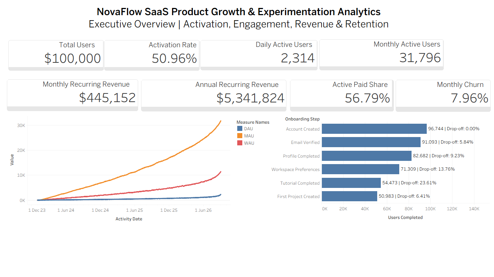
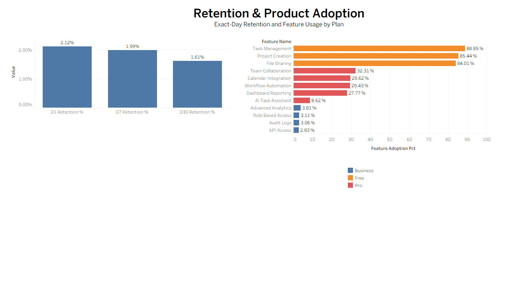
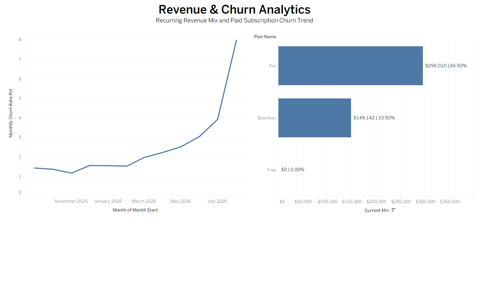
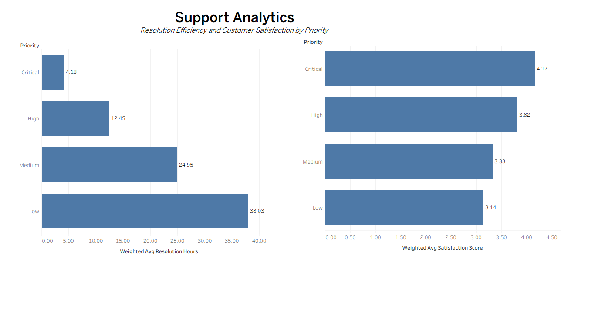
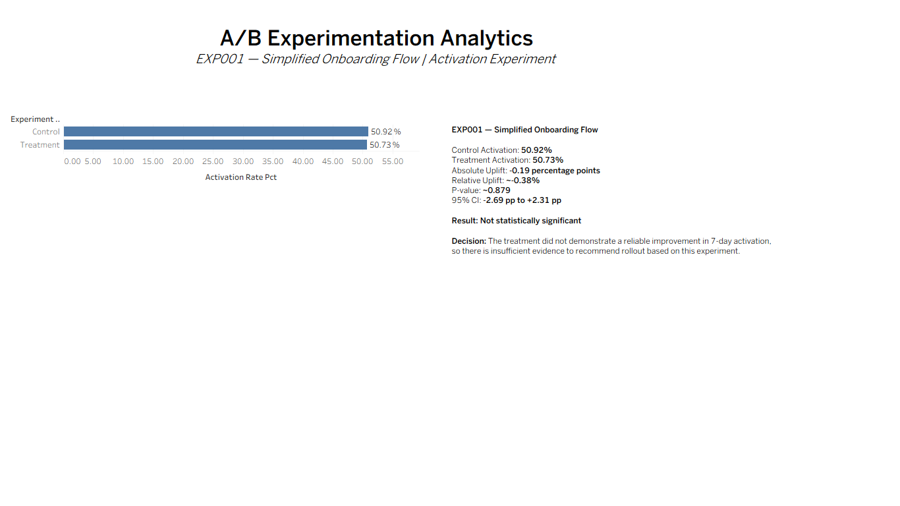

# NovaFlow SaaS Product Growth & Experimentation Analytics

An end-to-end SaaS analytics engineering and business intelligence project designed to simulate how a modern product analytics team collects, transforms, validates, analyzes, experiments on, and visualizes customer behavior and subscription performance.

The project combines **Python, AWS S3, Snowflake, dbt, SQL, statistical experimentation, and Tableau** to build a production-style analytics workflow from raw source data through executive dashboards.

> **Note:** This project uses intentionally generated synthetic data to simulate a realistic SaaS environment without exposing proprietary or customer data. Business findings apply only to the simulated dataset.

---

## Business Problem

NovaFlow is a fictional SaaS productivity platform experiencing strong user acquisition but uncertain downstream engagement, retention, feature adoption, and paid conversion.

The analytics solution was designed to answer questions such as:

- How many registered users successfully activate?
- Where do users drop off during onboarding?
- How are DAU, WAU, and MAU changing over time?
- Which product features are most widely adopted?
- How well are users retained after registration?
- What is the current MRR and ARR?
- Which subscription plans contribute the most recurring revenue?
- How is paid subscription churn changing?
- How efficiently are support tickets resolved?
- Does a simplified onboarding experience improve activation?

---

## Solution Architecture

```text
Synthetic SaaS Source Data
        │
        ▼
Python Data Generation
        │
        ▼
Amazon S3
Raw Cloud Storage
        │
        ▼
Snowflake RAW Schema
        │
        ▼
dbt Transformations
        │
        ├── STAGING
        │
        └── ANALYTICS
        │
        ▼
SQL + Statistical Analysis
        │
        ▼
Tableau Dashboards
```

---

## Technology Stack

| Area | Technologies |
|---|---|
| Data Generation | Python, Pandas, NumPy |
| Cloud Storage | Amazon S3 |
| Cloud Warehouse | Snowflake |
| Transformation | dbt |
| Querying | SQL |
| Experimentation | Python, statistical hypothesis testing |
| Visualization | Tableau Desktop |
| Version Control | Git, GitHub |
| Development | VS Code, Jupyter Notebook |

---

## Dataset Scale

The simulated NovaFlow analytics environment contains:

- **13 interconnected source datasets**
- **3,146,684 raw records**
- **100,000 users**
- **535,936 sessions**
- **1,601,461 product events**
- Subscription, payment, onboarding, marketing, support, feature usage, and experimentation data

The datasets were designed with realistic primary-key and foreign-key relationships across users, organizations, plans, subscriptions, sessions, product events, and experiments.

---

## Data Quality Engineering

Intentional data-quality issues were injected into the RAW layer to simulate real-world ingestion challenges.

Examples included:

- Duplicate records
- Missing values
- Invalid categorical values
- Future timestamps
- Broken foreign-key references
- Negative payment amounts
- Invalid currencies
- Invalid subscription statuses

The dbt staging layer was used to clean, standardize, deduplicate, cast, and validate the data before analytical modeling.

The final dbt pipeline completed successfully with:

**108 models/tests executed successfully with 0 errors.**

---

## Analytics Models

The Snowflake analytics layer contains reusable dbt marts supporting different business domains, including:

```text
mart_executive_kpis
mart_daily_engagement
mart_user_activation
mart_user_retention
mart_onboarding_funnel
mart_feature_adoption
mart_subscription_revenue
mart_monthly_churn
mart_support_performance
mart_experiment_activation
```

These marts provide analysis-ready datasets for BI and statistical analysis without querying raw transactional data directly.

---

# Key Business Findings

## Executive KPIs

| KPI | Result |
|---|---:|
| Total Users | 100,000 |
| Activated Users | 50,957 |
| Activation Rate | 50.96% |
| DAU | 2,314 |
| WAU | 11,437 |
| MAU | 31,796 |
| DAU / MAU Ratio | 7.28% |
| MRR | $445,152 |
| ARR | $5,341,824 |
| Active Paid Subscriptions | 26,446 |
| Active Paid Share | 56.79% |
| August 2026 Paid Churn | 7.96% |

---

## Onboarding Funnel

The onboarding funnel revealed progressive user drop-off across six onboarding stages.

| Step | Users Completed | Step Drop-off |
|---|---:|---:|
| Account Created | 96,744 | 0.00% |
| Email Verified | 91,093 | 5.84% |
| Profile Completed | 82,682 | 9.23% |
| Workspace Preferences | 71,309 | 13.76% |
| Tutorial Completed | 54,473 | 23.61% |
| First Project Created | 50,983 | 6.41% |

The largest onboarding loss occurred between **Workspace Preferences and Tutorial Completed**, with a **23.61% step drop-off**.

---

## User Retention

Exact-day retention declined across the evaluated lifecycle checkpoints:

| Metric | Retention |
|---|---:|
| D1 Retention | 2.12% |
| D7 Retention | 1.99% |
| D30 Retention | 1.61% |

These metrics use an **exact-day retention definition**, rather than rolling-window retention.

---

## Feature Adoption

The most widely adopted product capabilities were:

| Feature | Adoption |
|---|---:|
| Task Management | 88.85% |
| Project Creation | 85.44% |
| File Sharing | 84.01% |
| Team Collaboration | 32.31% |
| Calendar Integration | 29.62% |
| Workflow Automation | 29.43% |
| Dashboard Reporting | 27.77% |
| AI Task Assistant | 8.62% |
| Advanced Analytics | 3.81% |
| Role Based Access | 3.11% |
| Audit Logs | 3.06% |
| API Access | 2.83% |

Core Free-tier capabilities have substantially broader adoption than advanced Pro and Business capabilities.

---

## Subscription Revenue

Current recurring revenue is concentrated across the two paid plans:

| Plan | MRR | MRR Share |
|---|---:|---:|
| Pro | $296,010 | 66.50% |
| Business | $149,142 | 33.50% |
| Free | $0 | 0.00% |

Total MRR:

**$445,152**

Annualized recurring revenue:

**$5,341,824**

---

## Paid Subscription Churn

Paid subscription churn increased materially during the most recent completed months.

The trailing twelve-month visualization focuses on:

**September 2025 → August 2026**

August 2026 paid churn reached:

**7.96%**

The analysis intentionally excludes the partial September 2026 period to prevent misleading incomplete-period comparisons.

---

## Support Analytics

### Average Resolution Time by Priority

| Priority | Avg Resolution Time |
|---|---:|
| Critical | 4.18 hours |
| High | 12.45 hours |
| Medium | 24.95 hours |
| Low | 38.03 hours |

### Average Satisfaction by Priority

| Priority | Avg Satisfaction |
|---|---:|
| Critical | 4.17 |
| High | 3.82 |
| Medium | 3.33 |
| Low | 3.15 |

Weighted averages were used because the support mart contains multiple ticket-category records within each priority level.

---

# A/B Experimentation

## EXP001 — Simplified Onboarding Flow

The experiment evaluated whether a simplified onboarding flow improved 7-day activation.

| Metric | Control | Treatment |
|---|---:|---:|
| Assigned Users | 3,048 | 3,103 |
| Activated Users | 1,552 | 1,574 |
| Activation Rate | 50.92% | 50.73% |

### Statistical Result

- Absolute uplift: **-0.19 percentage points**
- Relative uplift: **approximately -0.38%**
- p-value: **approximately 0.879**
- 95% confidence interval: **-2.69 pp to +2.31 pp**

### Decision

The result was **not statistically significant**.

The treatment did not demonstrate a reliable improvement in 7-day activation, so there is insufficient evidence to recommend rollout based on this experiment.

---

# Tableau Dashboards

## 1. Executive Overview



Provides a leadership-level overview of activation, engagement, revenue, churn, onboarding performance, and user growth.

---

## 2. Retention & Product Adoption



Analyzes D1/D7/D30 retention alongside feature adoption across Free, Pro, and Business capabilities.

---

## 3. Revenue & Churn



Tracks paid subscription churn and the contribution of each subscription plan to recurring revenue.

---

## 4. Support Analytics



Evaluates support resolution efficiency and customer satisfaction across ticket-priority levels.

---

## 5. A/B Experimentation



Compares control and treatment activation rates and presents the statistical experiment conclusion and rollout recommendation.

---

# Repository Structure

```text
saas-product-growth-experimentation-analytics/
│
├── data/
│   ├── raw/
│   ├── staging/
│   └── processed/
│
├── dbt/
│   └── novaflow_analytics/
│       ├── models/
│       │   ├── staging/
│       │   └── marts/
│       ├── tests/
│       ├── macros/
│       └── dbt_project.yml
│
├── docs/
│   ├── 01_business_requirements.md
│   ├── 02_requirements_elicitation.md
│   ├── 03_process_mapping.md
│   ├── 04_source_systems.md
│   ├── 05_raw_table_design.md
│   ├── 06_relationship_map.md
│   ├── 07_data_quality_rules.md
│   └── 08_data_design_review.md
│
├── python/
│   ├── 01_generate_reference_data.ipynb
│   ├── 02_raw_data_inventory.ipynb
│   ├── 03_aws_s3_validation.ipynb
│   └── 04_ab_test_analysis.ipynb
│
├── screenshots/
│   ├── 01_executive_overview.png
│   ├── 02_retention_product_adoption.png
│   ├── 03_revenue_churn.png
│   ├── 04_support_analytics.png
│   └── 05_experimentation.png
│
├── tableau/
│   └── NovaFlow_SaaS_Product_Growth_Analytics.twbx
│
└── README.md
```

---

# Skills Demonstrated

This project demonstrates hands-on experience with:

**Analytics Engineering**
- dbt modeling
- staging and mart architecture
- dimensional analytical modeling
- reusable business metrics
- automated data testing

**SQL & Data Warehousing**
- Snowflake
- joins
- CTEs
- window functions
- aggregations
- data-quality validation
- cloud warehouse design

**Cloud Analytics**
- Amazon S3
- AWS IAM
- secure Snowflake storage integration
- cloud-based raw data ingestion

**Product Analytics**
- user activation
- onboarding funnels
- DAU / WAU / MAU
- stickiness
- retention
- feature adoption
- subscription churn

**Revenue Analytics**
- MRR
- ARR
- paid subscription mix
- recurring-revenue contribution

**Experimentation**
- control vs treatment comparison
- hypothesis testing
- confidence intervals
- statistical significance
- experimentation decision-making

**Business Intelligence**
- Tableau
- KPI dashboards
- executive reporting
- funnel visualization
- product adoption analysis
- revenue and churn reporting

---

# Project Outcome

This project demonstrates a complete analytics lifecycle:

**Business Requirements → Data Design → Synthetic Data → AWS S3 → Snowflake → dbt → SQL → Statistics → Tableau → Business Recommendations**

Rather than focusing only on visualization, the project emphasizes how analysts and analytics engineers build reliable data products from raw cloud data through validated business-facing insights.